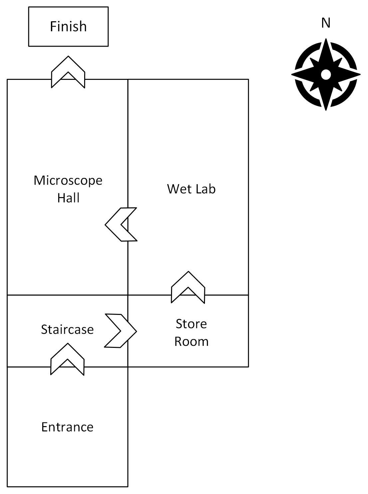

# ESCAPE THE LAB

Text-based adventure with a modern twist! Build an escape room where to exit you have to solve a series of puzzles.
This game uses the package `adventurelib` which provides nice decorators and classes for easily writing text based adventure games.
This project is designed to be used as a team building activity, where each team creates a puzzle and together you build a set of
escape rooms for another team to play.

# Developers

## Getting started

In the lab there are 6 puzzles that follow this map:





Puzzles contain a [Room](#define-your-room), [Items](#define-your-items) and [Locks](#defining-you-locks-and-unlocking-the-room). A puzzle can contain as many Items and Locks as you wish, but can only contain a single Room. If you define more than one Room variable then your
puzzle will not play correctly. Each puzzle has an `escape_direction` which corresponds to the direction you need to go to make it to the next room. Please do not change this variable as the map
is set. The flow of play is indicated on the map. There are two special puzzles the Entrance and the Finish. Entrance is a prepopulated example to show you how to set puzzle and the Finish puzzle is
an unlocked puzzle which lets the user finish the game.

When a player has completed all the Locks in a puzzle, the room unlocks and the player can move onto the next room. When a room is locked a player cannot move in any direction, including the direction
they came from until the room has been played through. Only when all the puzzles are complete can a player move through the entire Lab.

## Playing the Game

To play the game:
1. clone the repository
2. `pip install .` in the `adventure-time` folder
3. Once the game has been installed type `adventure-time` in the terminal and the game entrance and prompt will appear.

You can find what commands you can run in the game by typing `help` into the game prompt.
To exit the game, type `quit` into the game prompt.

### Development mode

To play the game in development mode use `pip intall -e .`. You can make changes to the code which will be entered into the game every time you launch `adventure-time`.
You can also test your room by playing in debug mode. To play in debug mode type `adventure-debug` into the console. The debug mode allows you to play a single puzzle,
and not work your way through the rooms.  You can edit the `debug.py` file to play the puzzle you are developing and test that the methods are working.

## The Game Playing script

They game playing script is based on the python package [`adventurelib`](https://adventurelib.readthedocs.io/en/stable/intro.html#starting-a-project). It can be found in `src/main.py`. Examples of using  `aventurelib` outside of the `ESCAPE THE LAB` format can be found in `demo.py`

## Creating your Puzzle

You can create your puzzle by editing the puzzle files in `src/puzzles`. (advanced) The puzzles are each based on the `EscapeRoom` metaclass, if you don't know what this means don't worry.
Open a file for a puzzle and they all have the same layout.

Starting at the top:

### Import statements

```
from escape_room import EscapeRoom
from lock import Lock
from adventurelib import Room, Item, Bag
```
These statments import the objects needed for Game Play . If you want to import more packages please use them here. If you want to use more functions from `adventurelib` please add the line `from adventurelib import *`.
Please note you CANNOT use the `@when` decorator from `adventurelib` in the Puzzle class. For more information on how to add player actions see here.

### Define your room
Next you need to define your puzzle Room:
```
    def __init__(self):
        self.name = "staircase"

        self.room = Room("""Enter the description of your room here""")
```
All you need to do is delete the text between the three quotation marks and enter the description of the room. Don't delete the quotations. You can be as descriptive as you like, the more descriptive the better. There is no limit of characters, but don't bore your audience. e.g.
```
    def __init__(self):
        self.name = "entrance"

        self.room = Room(""" You have entered an entrance hall.
                                It has a high vaulted ceiling and there is an ancient desk in the corner, papers scattered over its surface.
                                Above the desk is a clock, it has stopped. No one has been here for years. In
                                the north you see a pair of double doors and a key pad."""
```
### Define your Items

Now you can add items to your room. An item is defined by a description and a name. In the puzzle file an example of this commented out, but gives an example of how to implement items. You can edit this section
by deleting the # and writing your description and names in the quotations. You can also change the name of the item , but make sure you keep the `self.` in front of it.
```
# self.pen = Item("description of item", "item name")
# self.book = Item("description of item", "item name")
```


Players of your game can `examine` these items. When they do this command the description of your item appears.
Use items to create clues and descriptions for you puzzle.

For example:
```
self.clock = Item("The clocks hands are stuck at 17 minutes past 11", "clock")
self.papers = Item("The papers are a manuscript of a book. The title reads: 'Stopped Time Unlocks Doors'", "papers")
self.desk = Item("There is an old mahogany desk, with yellowing papers scattered on the surface", "desk")
```
The first two items: `clock` and `papers`, give the player clues to the puzzle. The third item, `desk`, is a purely descriptive item to slow game progress.

When the player enters into the game prompt
```
examine clock
```
They will get the following returned:
```
The clocks hands are stuck at 17 minutes past 11
>
```

### Defining you Locks and unlocking the room

Locks are a special type of item. They have all the same properties of Items and an extra property which is the answer you need to unlock them. To escape from the room you first need to unlock all the locks.
The first thing you need to do is define your lock in the same way that you define your item giving the extra answer field.
e.g.
```
self.padlock = Lock("9999", "The padlock has a 4 number combination to unlock","padlock")

```
The above lock needs an answer of 9999 to be opened. You can change the answer to anything you want as long as it is a string. It can be a word, a set of numbers or a group of words. If you want to use another item in the room to unlock the lock you would give the answer as the name of that item. e.g.
```
self.old_key = Item('An large old key hangs on a nail' , 'old key')
self.padlock = Lock("old key", "A rusty padlock holds together a thick chain wrapped tightly around the gates. It needs a large key to open it", "padlock")
```

If a player examines a lock (using the `examine` command) then they will be returned a description. To unlock the lock a player would need to first try the lock using:
```
try padlock
A rusty padlock holds together a thick chain wrapped tightly around the gates. It needs a large key to open it
>

```

To unlock the padlock the player can write
```
enter old key
The answer is correct. You have unlocked the lock
>
```

To unlock the room you need to edit the `room_complete` function. This is where you build your logic for how to exit your room. The simplest room completed function is shown below.
There is one lock - the padlock and when it is is unlocked the whole room unlocks.

```
    # Unlock the room by setting this test lock method. Once all the locks are open
    # the puzzle can be unlocked. You can implement this method how you like. Delete pass
    # and put your code in the place. An example is in the comments.
    def room_completed(self):

         if self.padlock.locked:
             self.locked=True
         else:
            self.locked=False

```
If you add more locks then this logic becomes more complicated.

Once the room is complete you want to give a description of what happens next and hint to your player which direction they would like to go in. You can do this by editing the
`escape` function. The `escape` function must not take any arguments (remain a void method), but you can edit the `self.escape_room` function to give the direction of your escape,
set by the [`self.escape_direction`](#define-your-room) variable, and then a description of what happens when you escape the room e.g  `self.escape_room("east","The door slides open reavealing the next room")`
```
   # Define the escape in this method. This will be triggered once all the puzzles are completed
    def escape(self):
        self.escape_room("direction", "description of what happens next")

```
Do all this and you can complete your puzzle.

# Testing your puzzle in debug mode
Ideally you do not what to have to play all the rooms to test out your room so we have a debug mode where you can test out your room. Open the file `debug.py`
and edit in two places:

Firstly add your room by editing the variable `my_puzzle` to instantiate your class.
```
############################## Game Loop ##########################################
def lock_the_room():

    ######################### Add Puzzles #########################

    my_puzzle = Entrance() # change this to be the name of your puzzle
```

Then finally you need to edit the relationship between your room and the finsih room.
```
    ############### Add directional relationship #################

    # This allows you to test escaping to another room
    finish_room = Finish()

    my_puzzle.room.north = finish_room  # You need to edit this line so it has the escape direction of your room
    #e.g my_puzzle.room.west = finish_room
```
So if your `self.escape_direction` is `east` you would edit the line to look like this:
```
my_puzzle.room.east= finish_room  # You need to edit this line so it has the escape direction of your room
```

To [play your game](#playing-the-game) run `adventure-debug` in the terminal.

## Player Actions

Player Actions have to be defined in the game script e.g. `main.py` of `debug.py` . Currently there are these actions:
```
go DIRECTION
examine ITEM
try LOCK
enter KEY
where am i
is it open
```

Players can see what actions they have by running the `help` command in the game prompt.

You can add another action to the game. If you do it will be available to all players. Please test it first in `debug.py`
to check it works.
```
############ Define Player Actions #################

@when('examine ITEM')
def examine(item):
    """T
    Enter 'examine <item_name>' into game prompt to get the description of items in a room. e.g. > examine box

    Args:
        item (str): the name of the item.
    """

    if item in current_puzzle.items:
        current_item = current_puzzle.items.find(item)
        say(current_item)
    else:
        say(f'There is no {item} in this room')
```
To find more examples please see the `demo.py` script.
